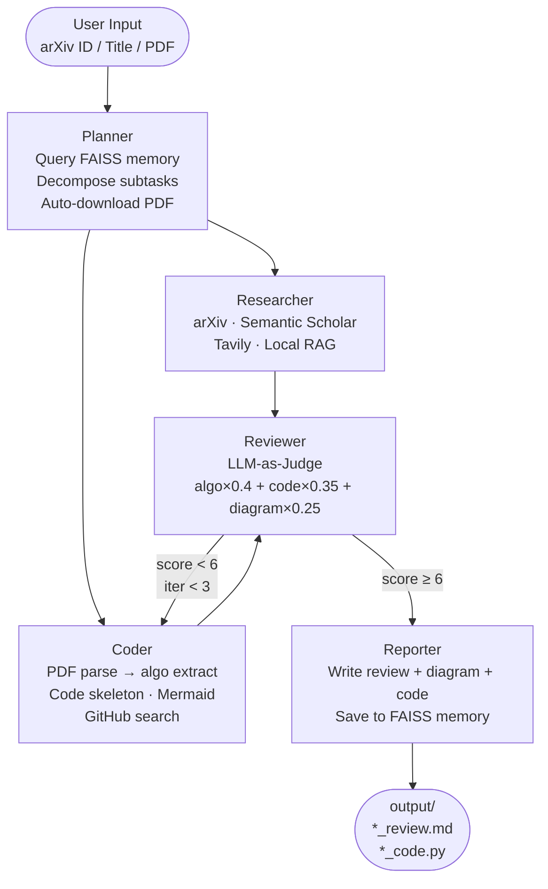

# PaperCoder

**LangGraph-based multi-agent system for deep reading academic papers.**

Input a paper title, arXiv ID, or local PDF — get back a structured review, an algorithm flowchart, and a Python code skeleton.

---

## How It Works



**Survey mode** (`--survey`): `Planner → Researcher → Surveyor` — multi-paper comparative review, skips Coder/Reviewer.

---

## Features

- **Auto PDF retrieval** — detects arXiv IDs and downloads PDFs automatically
- **Parallel execution** — Researcher and Coder run concurrently via LangGraph
- **Structured Mermaid generation** — nodes/edges extracted as JSON, assembled programmatically (no LLM syntax errors)
- **Self-Refine loop** — Reviewer scores on 3 dimensions; score < 6 sends Coder back with feedback (max 3 iterations)
- **Cross-session memory** — FAISS + sentence-transformers remembers previous research
- **Multi-provider LLM** — Gemini / Claude / OpenAI, auto-fallback by priority

---

## Installation

```bash
git clone https://github.com/your-username/papercoder.git
cd papercoder
pip install -r papercoder/requirements.txt
cp papercoder/.env.example papercoder/.env
# Fill in your API keys in papercoder/.env
```

**Minimum required keys** (`.env`):

```env
MODEL_PROVIDER=gemini
GOOGLE_API_KEY=...        # https://aistudio.google.com/app/apikey
GEMINI_MODEL=gemini-2.5-flash-lite

TAVILY_API_KEY=...        # https://tavily.com
GITHUB_TOKEN=...          # GitHub → Settings → Developer settings
```

> Gemini free tier is generous enough for most use. Claude and OpenAI work as drop-in alternatives — set `MODEL_PROVIDER=anthropic` or `openai`.

---

## Usage

```bash
# Single paper deep-read (recommended: arXiv ID)
python -m papercoder.main "arxiv:1706.03762"
python -m papercoder.main "Attention Is All You Need"

# With a local PDF
python -m papercoder.main "LoRA" --pdf ./papercoder/rag/lora.pdf

# Multi-paper survey on a topic
python -m papercoder.main "efficient Transformer attention" --survey

# Follow-up research (find papers that improve on a specific work)
python -m papercoder.main "LLaDA optimization" --survey --followup "LLaDA"

# Skip LLM-as-Judge evaluation (faster)
python -m papercoder.main "arxiv:2502.09992" --no-judge
```

Output is saved to `papercoder/output/`:
- `*_review.md` — structured review (1500–2500 words) + Mermaid flowchart + GitHub refs
- `*_code.py` — Python code skeleton with type annotations and TODO comments

---

## Local PDF RAG

Place your own PDFs in `papercoder/rag/` to enable local retrieval-augmented search. The index is built automatically on first run and persisted in `papercoder/chroma_db/`.

PDFs auto-downloaded from arXiv are cached in `papercoder/papers/` and also indexed.

---

## Tech Stack

| Layer | Technology |
|-------|-----------|
| Orchestration | LangGraph 0.2+, LangChain 0.3+ |
| LLM | Gemini 2.5 Flash Lite / Claude Sonnet 4.6 / GPT-4o |
| Academic search | arXiv API, Semantic Scholar REST API |
| Web search | Tavily |
| Local RAG | LlamaIndex + ChromaDB |
| PDF parsing | PyMuPDF (default), Marker (optional, higher quality) |
| GitHub search | GitHub MCP Server (npx) |
| Long-term memory | FAISS + sentence-transformers (all-MiniLM-L6-v2) |
| Session memory | LangGraph MemorySaver |

---

## Project Structure

```
papercoder/
├── main.py              # CLI entry point
├── graph.py             # LangGraph state machines (read + survey)
├── state.py             # PaperCoderState
├── llm_factory.py       # Multi-provider LLM factory with lru_cache
├── nodes/
│   ├── planner.py       # FAISS memory query + Pydantic task decomposition
│   ├── researcher.py    # Tool-calling agent (4 retrieval sources)
│   ├── coder.py         # PDF parse + code gen + structured Mermaid
│   ├── reviewer.py      # LLM-as-Judge + should_refine routing
│   ├── reporter.py      # Final output assembly + memory write
│   └── surveyor.py      # Multi-paper comparative analysis
├── tools/               # arxiv / semantic_scholar / tavily / local_rag / paper_parser / github_mcp
├── memory/long_term.py  # FAISS memory with JSON fallback
├── eval/judge.py        # Standalone LLM-as-Judge evaluator
├── rag/                 # Place your own PDFs here for local RAG
├── papers/              # Auto-downloaded arXiv PDFs (cache)
└── output/              # Generated reviews and code skeletons
```

---

## License

MIT
