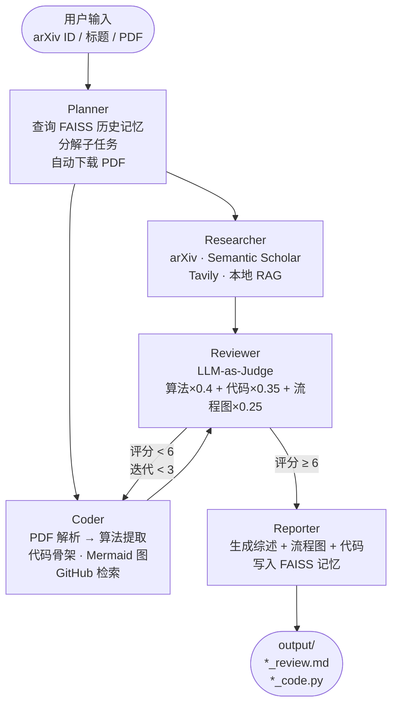

# PaperCoder

**基于 LangGraph 的多 Agent 论文精读系统。**

输入论文标题、arXiv ID 或本地 PDF，自动输出结构化综述、算法流程图和 Python 代码骨架。

---

## 工作流程



**Survey 模式**（`--survey`）：`Planner → Researcher → Surveyor`，多论文横向调研，跳过 Coder/Reviewer。

---

## 主要特性

- **自动获取 PDF** — 识别 arXiv ID，自动下载论文
- **并行执行** — Researcher 和 Coder 通过 LangGraph 并发运行
- **结构化 Mermaid 生成** — 节点/边以 JSON 提取后程序化拼接，彻底避免 LLM 语法错误
- **Self-Refine 循环** — Reviewer 三维打分，低于 6 分将 Coder 退回重做（最多 3 轮）
- **跨会话记忆** — FAISS + sentence-transformers，记住历史研究上下文
- **多 LLM 供应商** — Gemini / Claude / OpenAI，按优先级自动 fallback

---

## 安装

```bash
git clone https://github.com/hhc2002/papercoder.git
cd papercoder
pip install -r papercoder/requirements.txt
cp papercoder/.env.example papercoder/.env
# 在 papercoder/.env 中填入 API Keys
```

**最少需要配置**（`.env`）：

```env
MODEL_PROVIDER=gemini
GOOGLE_API_KEY=...        # https://aistudio.google.com/app/apikey
GEMINI_MODEL=gemini-2.5-flash-lite

TAVILY_API_KEY=...        # https://tavily.com
GITHUB_TOKEN=...          # GitHub → Settings → Developer settings
```

> Gemini 免费额度足够日常使用。切换到 Claude 或 OpenAI 只需修改 `MODEL_PROVIDER=anthropic` 或 `openai`。

---

## 使用方法

```bash
# 单篇精读（推荐用 arXiv ID）
python -m papercoder.main "arxiv:1706.03762"
python -m papercoder.main "Attention Is All You Need"

# 提供本地 PDF
python -m papercoder.main "LoRA" --pdf ./papercoder/rag/lora.pdf

# 领域综述（多论文横向调研）
python -m papercoder.main "efficient Transformer attention" --survey

# 跟进调研（查找某论文的后续优化工作）
python -m papercoder.main "LLaDA optimization" --survey --followup "LLaDA"

# 跳过 LLM-as-Judge 评估（更快）
python -m papercoder.main "arxiv:2502.09992" --no-judge
```

输出保存在 `papercoder/output/`：
- `*_review.md` — 结构化综述（1500-2500字）+ Mermaid 流程图 + GitHub 开源引用
- `*_code.py` — Python 代码骨架（含类型注解和 TODO 注释）

**示例输出：**
| 论文 | 综述 | 代码 |
|------|------|------|
| Attention Is All You Need | [review.md](papercoder/output/Attention%20Is%20All%20You%20Need_review.md) | [code.py](papercoder/output/Attention%20Is%20All%20You%20Need_code.py) |
| LLaDA-V (arxiv:2502.09992) | [review.md](papercoder/output/arxiv_2502_09992_review.md) | [code.py](papercoder/output/arxiv_2502_09992_code.py) |

---

## 本地 PDF RAG

将自己的论文 PDF 放入 `papercoder/rag/`，即可启用本地检索增强。索引在首次运行时自动构建，持久化在 `papercoder/chroma_db/`。

arXiv 自动下载的 PDF 缓存在 `papercoder/papers/`，同样会被索引。

---

## 技术栈

| 层级 | 技术 |
|------|------|
| Agent 编排 | LangGraph 0.2+，LangChain 0.3+ |
| LLM | Gemini 2.5 Flash Lite / Claude Sonnet 4.6 / GPT-4o |
| 学术检索 | arXiv API，Semantic Scholar REST API |
| 网络搜索 | Tavily |
| 本地 RAG | LlamaIndex + ChromaDB |
| PDF 解析 | PyMuPDF（默认），Marker（可选，高质量） |
| GitHub 检索 | GitHub MCP Server（npx） |
| 长期记忆 | FAISS + sentence-transformers（all-MiniLM-L6-v2） |
| 会话记忆 | LangGraph MemorySaver |

---

## 项目结构

```
papercoder/
├── main.py              # CLI 入口，--survey / --followup / --no-judge
├── graph.py             # LangGraph 状态机（精读图 + Survey 图）
├── state.py             # PaperCoderState
├── llm_factory.py       # 多供应商 LLM 工厂，lru_cache 单例
├── nodes/
│   ├── planner.py       # FAISS 记忆查询 + Pydantic 结构化任务分解
│   ├── researcher.py    # Tool Calling Agent（四路检索，超长自动压缩）
│   ├── coder.py         # PDF 两阶段解析 + 代码生成 + 结构化 Mermaid
│   ├── reviewer.py      # LLM-as-Judge + should_refine 路由
│   ├── reporter.py      # 三件套整合 + FAISS 记忆写入
│   └── surveyor.py      # 多论文对比综述
├── tools/               # arxiv / semantic_scholar / tavily / local_rag / paper_parser / github_mcp
├── memory/long_term.py  # FAISS 记忆，JSON fallback
├── eval/judge.py        # 独立 LLM-as-Judge 评估器
├── rag/                 # 在此放置自己的论文 PDF
├── papers/              # arXiv 自动下载缓存
└── output/              # 生成结果：综述 + 代码骨架
```

---

## License

MIT
