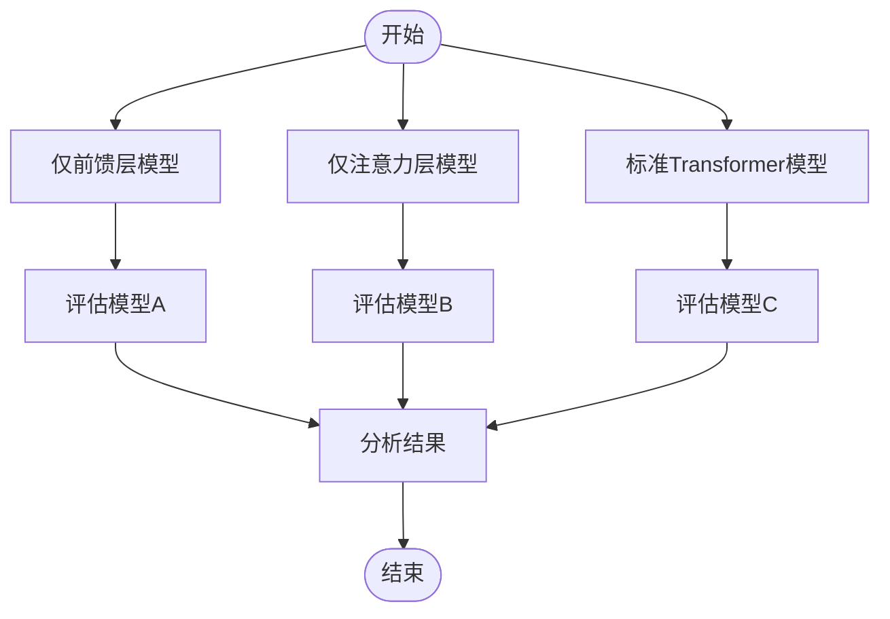

# Attention Is All You Need

---

## 📑 文字综述

# 论文精读报告：《Attention Is All You Need》

## 核心贡献

1.  **提出 Transformer 模型架构**: 该论文最核心的贡献是引入了 Transformer 模型，一种全新的序列到序列（Seq2Seq）模型架构。Transformer 完全摒弃了传统的循环神经网络（RNN）和卷积神经网络（CNN）在序列处理中的应用，而是完全依赖于注意力机制，特别是自注意力（Self-Attention）机制。
2.  **实现高效的长距离依赖捕捉**: 通过自注意力机制，Transformer 能够直接计算序列中任意两个位置之间的依赖关系，无论它们在序列中的距离有多远。这解决了 RNN/LSTM 在处理长序列时面临的梯度消失/爆炸问题和计算效率低下的瓶颈，极大地提升了模型捕捉长距离依赖的能力。
3.  **实现高度并行化训练**: 与 RNN 必须按时间步顺序处理输入不同，Transformer 的自注意力计算允许在序列的各个位置上并行进行。这种高度的并行性显著缩短了模型的训练时间，使得训练更大规模的模型和处理更大规模的数据集成为可能。
4.  **奠定现代 NLP 模型基础**: Transformer 的成功及其在机器翻译任务上取得的 SOTA 性能，为后续众多革命性的自然语言处理（NLP）模型（如 BERT, GPT 系列, RoBERTa 等）奠定了坚实的架构基础。它已成为当前绝大多数先进 NLP 模型的核心组件。

## 方法论详解

Transformer 模型的核心创新在于其完全基于注意力机制的 Encoder-Decoder 架构，摒弃了循环和卷积结构。其关键组件包括：

**1. 自注意力（Self-Attention）机制**:
自注意力允许模型在处理序列中的一个元素时，动态地权衡序列中所有其他元素的重要性。对于输入序列 $X = (x_1, x_2, ..., x_n)$，每个 $x_i$ 首先被映射到三个向量：Query ($Q$)、Key ($K$) 和 Value ($V$)。这些映射是通过可学习的权重矩阵 $W^Q, W^K, W^V$ 实现的：
$Q = XW^Q$
$K = XW^K$
$V = XW^V$

然后，计算每个 Query 与所有 Key 的相似度（通常使用点积），并进行缩放（除以 $\sqrt{d_k}$，其中 $d_k$ 是 Key 向量的维度，以防止点积过大导致梯度过小），然后通过 Softmax 函数得到注意力权重：
$Attention(Q, K, V) = Softmax(\frac{QK^T}{\sqrt{d_k}})V$

这个过程使得模型能够为序列中的每个位置生成一个加权表示，其中权重反映了该位置与其他位置的相关性。

**2. 多头注意力（Multi-Head Attention）**:
为了让模型能够从不同的表示子空间学习信息，Transformer 采用了多头注意力机制。它将 $Q, K, V$ 分别线性投影到 $h$ 个不同的低维空间，并在每个空间上独立执行自注意力计算。然后，将这 $h$ 个头的输出拼接起来，再通过一个线性层进行投影，得到最终的多头注意力输出。
$MultiHead(Q, K, V) = Concat(head_1, ..., head_h)W^O$
其中 $head_i = Attention(QW_i^Q, KW_i^K, VW_i^V)$。

**3. 位置编码（Positional Encoding）**:
由于 Transformer 模型本身不包含序列顺序信息（不像 RNN），为了引入位置信息，模型在输入嵌入（embedding）中加入了位置编码。论文中使用了固定（非学习）的正弦和余弦函数来生成位置编码，使得模型能够区分不同位置的词语，并能推断出相对位置关系。
$PE(pos, 2i) = sin(pos / 10000^{2i/d_{model}})$
$PE(pos, 2i+1) = cos(pos / 10000^{2i/d_{model}})$
其中 $pos$ 是位置， $i$ 是维度索引，$d_{model}$ 是模型的嵌入维度。

**4. Encoder-Decoder 架构**:
*   **Encoder**: 由 N 个相同的层堆叠而成。每一层包含两个子层：一个多头自注意力层和一个简单的、位置全连接的前馈网络。每个子层后都跟着一个残差连接（Residual Connection）和层归一化（Layer Normalization）。
*   **Decoder**: 也由 N 个相同的层堆叠而成。每一层包含三个子层：一个掩码（masked）多头自注意力层（用于防止预测当前位置时关注到未来的位置）、一个多头注意力层（用于关注 Encoder 的输出）和一个位置全连接的前馈网络。同样，每个子层后都跟着残差连接和层归一化。

**5. 前馈网络（Feed-Forward Network）**:
每个 Encoder 和 Decoder 层中都包含一个前馈网络，它是一个简单的两层全连接网络，中间有一个 ReLU 激活函数。这个网络对每个位置的表示进行独立的、非线性的变换。
$FFN(x) = max(0, xW_1 + b_1)W_2 + b_2$

**6. 残差连接与层归一化**:
残差连接（$x + Sublayer(x)$）帮助缓解深度网络中的梯度消失问题，使得模型更容易训练。层归一化（Layer Normalization）则对每一层的输入进行归一化，稳定了训练过程，加速了收敛。

## 与现有方法对比

| 特征/方法         | Transformer (Attention Is All You Need) | RNN/LSTM/GRU (循环模型) | CNN (卷积模型) |
| :---------------- | :------------------------------------- | :---------------------- | :------------- |
| **序列处理方式**  | 并行计算，基于注意力机制             | 顺序计算，按时间步处理  | 局部感受野，滑动窗口 |
| **长距离依赖**    | 极佳，直接计算任意位置关系           | 较差，易受梯度问题影响  | 较差，需要多层堆叠 |
| **计算并行性**    | 高，可高度并行化                     | 低，受限于序列长度      | 高，卷积核可并行 |
| **模型复杂度**    | 较高，但参数量相对可控               | 相对较低                | 相对较低       |
| **主要应用领域**  | 机器翻译，NLP 预训练模型             | 序列建模，早期 NLP      | 图像处理，文本分类 |
| **引入位置信息**  | 位置编码（Positional Encoding）        | 内置于循环结构          | 卷积核的相对位置 |

**分析**:

Transformer 的核心优势在于其对长距离依赖的建模能力和高度并行化的计算特性。传统的 RNN/LSTM/GRU 模型虽然在序列建模上取得了巨大成功，但其顺序处理的特性使其难以有效捕捉远距离的依赖关系，并且训练效率低下。CNN 在捕捉局部特征方面表现出色，并且计算可以并行化，但在建模长距离依赖方面需要通过堆叠多层或使用扩张卷积等方式，这会增加模型的复杂性，并且不如 Transformer 直接。Transformer 通过自注意力机制，能够直接建立序列中任意两个元素之间的联系，无论它们相距多远，这在处理长文本、基因序列等任务时具有天然优势。同时，其并行计算能力极大地提升了训练速度，使得更大、更深的模型成为可能，从而在机器翻译等任务上取得了显著的性能提升，并开启了深度学习在 NLP 领域的新篇章。

## 实现要点

1.  **精确实现注意力计算**: 自注意力机制中的点积、缩放、Softmax 以及与 Value 的加权求和是核心。需要注意矩阵维度匹配，以及缩放因子 $\sqrt{d_k}$ 的正确应用，以避免数值不稳定。
2.  **多头注意力的拆分与合并**: 实现多头注意力时，需要将 Query, Key, Value 向量按头数进行分割（或通过线性投影到不同子空间），在每个头上独立计算注意力，然后将所有头的输出拼接起来，最后再通过一个线性层进行投影。确保维度在分割和合并过程中正确处理。
3.  **位置编码的生成与添加**: 位置编码需要根据设定的维度和最大序列长度生成。最常见的是使用正弦和余弦函数，需要确保其与输入嵌入的维度一致，并正确地加到输入嵌入中，而不是替换。
4.  **残差连接与层归一化的顺序**: 在 Encoder 和 Decoder 的每个子层（自注意力、前馈网络）之后，都应该先应用残差连接（将子层输出与子层输入相加），然后再进行层归一化。这个顺序对于模型的稳定性和性能至关重要。
5.  **Decoder 中的掩码机制**: Decoder 的自注意力层需要实现掩码（masking）功能，以防止在预测当前位置的输出时，模型“看到”或关注到序列中其后的位置。这通常通过在 Softmax 函数之前将对应位置的注意力分数设置为一个非常小的负数（如负无穷）来实现。

## 局限性与未来方向

1.  **计算复杂度随序列长度平方增长**: Transformer 的自注意力机制在计算上需要计算序列中所有元素对之间的关系，其计算量和内存需求与序列长度的平方成正比 ($O(n^2)$)。这使得 Transformer 在处理非常长的序列（如长文档、高分辨率图像、长视频）时，计算成本变得非常高昂，成为一个主要的瓶颈。
2.  **缺乏显式的序列顺序建模能力**: 虽然位置编码引入了位置信息，但 Transformer 本身并不像 RNN 那样具有内在的序列顺序建模能力。对于某些需要严格顺序理解的任务，可能需要更复杂的结构或训练方法来弥补。
3.  **对位置信息的依赖**: Transformer 的性能高度依赖于位置编码的有效性。如何设计更优的位置编码方案，或者探索其他引入位置信息的方式，是未来的一个研究方向。

**未来方向**:
*   **降低计算复杂度**: 研究更高效的注意力变体，如稀疏注意力、线性注意力、局部注意力等，以降低对序列长度的平方依赖，使其能更好地处理长序列。
*   **结合其他模型**: 探索将 Transformer 与循环、卷积或其他模型结构相结合，以发挥各自的优势，例如在某些任务上可能比纯 Transformer 表现更好。
*   **更优的位置信息表示**: 研究更灵活、更具表达力的位置编码方法，或者探索无需显式位置编码的序列建模方法。
*   **Transformer 在多模态和非 NLP 领域的应用**: 进一步探索 Transformer 在计算机视觉、语音、多模态学习等领域的潜力，并针对不同模态的特点进行架构优化。

## 延伸阅读

1.  **原始论文**: Vaswani, A., Shazeer, N., Parmar, N., Uszkoreit, J., Jones, L., Gomez, A. N., ... & Polosukhin, I. (2017). Attention is all you need. *Advances in neural information processing systems*, *30*. (这是理解 Transformer 架构的必读文献。)
2.  **The Illustrated Transformer (博客)**: Jay Alammar. (2018). The Illustrated Transformer. *The Illustrated Transformer*. [https://jalammar.github.io/illustrated-transformer/](https://jalammar.github.io/illustrated-transformer/) (这篇博客以图文并茂的方式详细解释了 Transformer 的工作原理，是入门 Transformer 的绝佳资源。)
3.  **BERT: Pre-training of Deep Bidirectional Transformers for Language Understanding**: Devlin, J., Chang, M. W., Lee, K., & Toutanova, K. (2018). BERT: Pre-training of Deep Bidirectional Transformers for Language Understanding. *arXiv preprint arXiv:1810.04805*. (了解基于 Transformer 的预训练模型如何极大地推动了 NLP 领域的发展。)
4.  **Vision Transformer (ViT)**: Dosovitskiy, A., Beyer, L., Kolesnikov, A., Weissenborn, D., Zhai, X., Unterthiner, T., ... & Houlsby, N. (2020). An image is worth 16x16 words: Transformers for image recognition at scale. *arXiv preprint arXiv:2010.11929*. (展示了 Transformer 架构在计算机视觉领域的巨大成功和潜力。)
5.  **《Attention Is All You Need》论文解读 (中文博客)**: 许多国内技术博客和社区对该论文进行了深入的解读和分析，搜索“Attention Is All You Need 论文解读”可以找到大量优质的中文学习资源，例如一些知名的技术公众号和个人博客。

---

## 📊 算法流程图

---

## 🔗 GitHub 开源实现

### 1. brandokoch/attention-is-all-you-need-paper
- ⭐ 0 | 语言: N/A | 更新: 2026-01-29
- 描述: Original transformer paper: Implementation of Vaswani, Ashish, et al. "Attention is all you need." Advances in neural information processing systems. 2017.
- 链接：https://github.com/brandokoch/attention-is-all-you-need-paper

### 2. facebookresearch/TimeSformer
- ⭐ 0 | 语言: N/A | 更新: 2026-03-16
- 描述: The official pytorch implementation of our paper "Is Space-Time Attention All You Need for Video Understanding?"
- 链接：https://github.com/facebookresearch/TimeSformer

### 3. Skumarr53/Attention-is-All-you-Need-PyTorch
- ⭐ 0 | 语言: N/A | 更新: 2026-03-15
- 描述: Repo has PyTorch implementation "Attention is All you Need - Transformers" paper for Machine Translation from French queries to English.
- 链接：https://github.com/Skumarr53/Attention-is-All-you-Need-PyTorch

### 4. LiamMaclean216/Pytorch-Transfomer
- ⭐ 0 | 语言: N/A | 更新: 2026-03-09
- 描述: My implementation of the transformer architecture from the Attention is All you need paper applied to time series.
- 链接：https://github.com/LiamMaclean216/Pytorch-Transfomer

### 5. akurniawan/pytorch-transformer
- ⭐ 0 | 语言: N/A | 更新: 2024-12-20
- 描述: Implementation of "Attention is All You Need" paper
- 链接：https://github.com/akurniawan/pytorch-transformer
6. rishabkr/Attention-Is-All-You-Need-Explained-PyTorch
- ⭐ 0 | 语言: N/A | 更新: 2025-12-22
- 描述: A paper implementation and tutorial from scratch combining various great resources for implementing Transformers discussesd in Attention in All You Need Paper for the task of German to English Translation.
- 链接：https://github.com/rishabkr/Attention-Is-All-You-Need-Explained-PyTorch
7. MB1151/attention_is_all_you_need
- ⭐ 0 | 语言: N/A | 更新: 2026-02-21
- 描述: Implementation of the Attention Is All You Need paper
- 链接：https://github.com/MB1151/attention_is_all_you_need
8. bashnick/transformer
- ⭐ 0 | 语言: N/A | 更新: 2026-01-15
- 描述: A codebase implementing a simple GPT-like model from scratch based on the Attention
