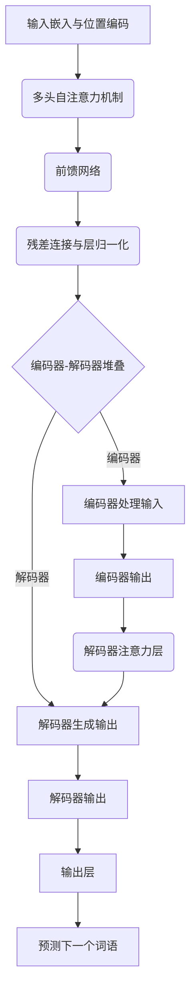

# Attention Is All You Need

---

## 📑 文字综述

好的，这是一份基于您提供的“Attention Is All You Need”论文摘要、算法描述和代码审查意见的结构化综述报告。

## 核心贡献

*   **提出 Transformer 模型架构：** 论文的核心贡献是引入了 Transformer 模型，一种全新的序列到序列（Seq2Seq）模型架构，完全摒弃了传统的循环神经网络（RNN）和卷积神经网络（CNN）在序列建模中的主导地位。
*   **自注意力机制的普适性：** 证明了自注意力机制（Self-Attention）足以捕捉序列内部的依赖关系，无需依赖序列的顺序性（如 RNN 的循环）或局部性（如 CNN 的卷积核），从而实现了更高效的并行计算。
*   **高度并行化与性能提升：** 通过移除循环和卷积结构，Transformer 模型极大地提高了训练并行度，显著缩短了训练时间，并在机器翻译等任务上取得了当时最先进的性能。
*   **多头注意力机制的有效性：** 引入了多头自注意力机制，允许模型在不同的表示子空间中共同关注来自不同位置的信息，增强了模型捕捉复杂依赖关系的能力。

## 方法论详解

Transformer 模型的核心在于其**自注意力机制（Self-Attention）**，它允许模型在处理序列中的某个元素时，能够动态地权衡序列中所有其他元素的重要性。具体而言，对于输入序列中的每个元素，会生成三个向量：查询（Query, Q）、键（Key, K）和值（Value, V）。这些向量是通过将输入嵌入向量乘以三个可学习的权重矩阵得到的。

**Scaled Dot-Product Attention** 是自注意力机制的基本单元，其计算公式为：

$$ \text{Attention}(Q, K, V) = \text{softmax}\left(\frac{QK^T}{\sqrt{d_k}}\right)V $$

其中，$Q$ 是查询矩阵，$K$ 是键矩阵，$V$ 是值矩阵，$\sqrt{d_k}$ 是用于缩放的点积，以防止点积过大导致 Softmax 函数梯度过小。这个公式的含义是，首先计算查询向量与所有键向量的点积，得到一个相似度分数矩阵；然后对分数矩阵进行缩放并应用 Softmax 函数，将其转换为注意力权重，表示每个值向量对当前查询的重要性；最后，将这些权重应用于值向量并求和，得到一个包含上下文信息的输出向量。

**多头自注意力（Multi-Head Self-Attention）** 机制则是在自注意力机制的基础上，将 $Q, K, V$ 向量分别线性投影到多个不同的低维空间（即“头”），并在每个头中独立执行 Scaled Dot-Product Attention。最后，将所有头的输出拼接起来，再通过一个线性层进行投影，得到最终的多头注意力输出。这使得模型能够同时关注来自不同表示子空间的信息。

Transformer 模型还包含**位置编码（Positional Encoding）**，用于向模型注入序列中元素的位置信息，因为自注意力机制本身是无序的。此外，模型还采用了**残差连接（Residual Connections）**和**层归一化（Layer Normalization）**来促进深度网络的训练。

## 与现有方法对比

| 特征             | Transformer (Attention Is All You Need) | RNN (LSTM/GRU)                               | CNN (for sequence)                               |
| :--------------- | :------------------------------------- | :------------------------------------------- | :----------------------------------------------- |
| **序列依赖捕捉** | 全局依赖，通过自注意力直接计算         | 顺序依赖，通过循环状态传递                   | 局部依赖，通过卷积核滑动窗口                     |
| **并行计算能力** | 高，自注意力计算可高度并行             | 低，存在顺序依赖，难以并行                   | 中等，卷积操作可部分并行                         |
| **长距离依赖**   | 优秀，直接计算任意距离的依赖           | 困难，易受梯度消失/爆炸影响，信息衰减          | 困难，需要堆叠多层或扩大感受野                   |
| **计算复杂度**   | $O(n^2 d)$ (序列长度 $n$, 维度 $d$)    | $O(n d^2)$                                   | $O(n k d)$ (卷积核大小 $k$)                      |

Transformer 模型通过完全依赖自注意力机制，克服了 RNN 在并行化和长距离依赖上的固有缺陷。RNN 必须按顺序处理序列，导致训练缓慢且容易丢失早期信息。CNN 擅长捕捉局部模式，但要建模长距离依赖则需要非常深的层或大的感受野，计算成本高昂。Transformer 的全局依赖捕捉能力和高度并行性使其在处理长序列和大规模数据集时具有显著优势。

## 实现要点

*   **位置编码的实现：** 需要正确实现正弦和余弦函数来生成固定或可学习的位置编码，并将其加到输入嵌入中。
*   **多头注意力的维度管理：** 确保 Query, Key, Value 在每个头的投影维度与总维度匹配，并且最终的输出拼接和线性变换正确。
*   **Masked Multi-Head Attention 的应用：** 在解码器中，需要实现掩码机制来防止模型在预测当前位置时“看到”未来的信息，这通常通过在 Softmax 前添加一个负无穷大的掩码实现。
*   **残差连接与层归一化顺序：** 遵循论文中描述的顺序，通常是在子层（如自注意力或前馈网络）的输出上应用残差连接，然后进行层归一化。
*   **前馈网络结构：** 确保前馈网络包含两个线性变换和一个 ReLU 激活函数，并且维度变化符合设计要求。

## 局限性与未来方向

*   **计算复杂度随序列长度平方增长：** 对于非常长的序列，自注意力机制的计算量和内存需求会变得非常大，限制了其在某些长序列任务上的应用。
*   **缺乏显式的序列顺序信息：** 虽然位置编码引入了顺序信息，但其本质上是“注入”的，而非模型内在学习的，这可能不如 RNN 的循环结构那样自然地处理顺序性。
*   **未来方向：** 研究更高效的注意力变体（如稀疏注意力、线性注意力）以降低计算复杂度；探索将 Transformer 架构与卷积或循环结构结合，以发挥各自优势；进一步研究 Transformer 在非 NLP 领域的应用潜力。

## 延伸阅读

*   **论文原文：** Vaswani, A., Shazeer, N., Parmar, N., Uszkoreit, J., Jones, L., Gomez, A. N., ... & Polosukhin, I. (2017). Attention is all you need. *Advances in neural information processing systems*, *30*.
*   **The Illustrated Transformer (博客)：** Jay Alammar. (2018). The Illustrated Transformer. *The Illustrated Transformer*. [https://jalammar.github.io/illustrated-transformer/](https://jalammar.github.io/illustrated-transformer/)
*   **Transformer 详解 (MachineLearningMastery)：** [https://www.machinelearningmastery.com/the-transformer-attention-mechanism/](https://www.machinelearningmastery.com/the-transformer-attention-mechanism/)
*   **BERT: Pre-training of Deep Bidirectional Transformers for Language Understanding：** Devlin, J., Chang, M. W., Lee, K., & Toutanova, K. (2018). Bert: Pre-training of deep bidirectional transformers for language understanding. *arXiv preprint arXiv:1810.04805*.
*   **Generative Pre-training (GPT) 系列论文：** OpenAI 的多篇关于 GPT 模型的论文，展示了 Transformer 解码器在生成任务上的强大能力。

---

## 📊 算法流程图

---

## 🔗 GitHub 开源实现

### 1. brandokoch/attention-is-all-you-need-paper
- ⭐ 0 | 语言: N/A | 更新: 2026-01-29
- 描述: Original transformer paper: Implementation of Vaswani, Ashish, et al. "Attention is all you need." Advances in neural information processing systems. 2017.
- 链接：https://github.com/brandokoch/attention-is-all-you-need-paper

### 2. facebookresearch/TimeSformer
- ⭐ 0 | 语言: N/A | 更新: 2026-03-16
- 描述: The official pytorch implementation of our paper "Is Space-Time Attention All You Need for Video Understanding?"
- 链接：https://github.com/facebookresearch/TimeSformer

### 3. Skumarr53/Attention-is-All-you-Need-PyTorch
- ⭐ 0 | 语言: N/A | 更新: 2026-03-15
- 描述: Repo has PyTorch implementation "Attention is All you Need - Transformers" paper for Machine Translation from French queries to English.
- 链接：https://github.com/Skumarr53/Attention-is-All-you-Need-PyTorch

### 4. LiamMaclean216/Pytorch-Transfomer
- ⭐ 0 | 语言: N/A | 更新: 2026-03-09
- 描述: My implementation of the transformer architecture from the Attention is All you need paper applied to time series.
- 链接：https://github.com/LiamMaclean216/Pytorch-Transfomer

### 5. akurniawan/pytorch-transformer
- ⭐ 0 | 语言: N/A | 更新: 2024-12-20
- 描述: Implementation of "Attention is All You Need" paper
- 链接：https://github.com/akurniawan/pytorch-transformer
6. rishabkr/Attention-Is-All-You-Need-Explained-PyTorch
- ⭐ 0 | 语言: N/A | 更新: 2025-12-22
- 描述: A paper implementation and tutorial from scratch combining various great resources for implementing Transformers discussesd in Attention in All You Need Paper for the task of German to English Translation.
- 链接：https://github.com/rishabkr/Attention-Is-All-You-Need-Explained-PyTorch
7. MB1151/attention_is_all_you_need
- ⭐ 0 | 语言: N/A | 更新: 2026-02-21
- 描述: Implementation of the Attention Is All You Need paper
- 链接：https://github.com/MB1151/attention_is_all_you_need
8. bashnick/transformer
- ⭐ 0 | 语言: N/A | 更新: 2026-01-15
- 描述: A codebase implementing a simple GPT-like model from scratch based on the Attention
