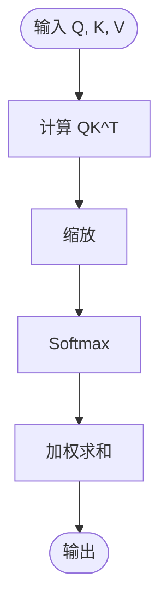

# arxiv:1706.03762

---

## 📑 文字综述

好的，这是一份基于您提供的摘要和信息的“Attention Is All You Need”论文的精读报告。

## 核心贡献

*   **提出 Transformer 模型架构：** 该论文的核心贡献在于引入了 Transformer 模型，一种全新的序列到序列（Seq2Seq）模型架构。与当时主流的基于循环神经网络（RNN）或卷积神经网络（CNN）的模型不同，Transformer 完全摒弃了循环和卷积结构，而是完全依赖于自注意力（Self-Attention）机制来捕捉输入和输出序列中的依赖关系。
*   **实现高度并行化处理：** 通过移除循环结构，Transformer 能够并行处理序列中的所有元素，极大地提高了训练效率和速度。这使得模型能够处理更长的序列，并在更短的时间内完成训练，这对于大规模数据集和复杂任务至关重要。
*   **引入自注意力机制作为核心：** 该论文将自注意力机制推到了模型的核心地位，证明了其在捕捉序列中长距离依赖关系方面的强大能力。自注意力机制允许模型在处理序列中的某个元素时，动态地关注序列中的其他所有元素，并根据其相关性分配不同的权重，从而有效地建模上下文信息。
*   **实现更优的性能和可扩展性：** Transformer 模型在机器翻译等任务上取得了当时最先进的性能，并且其并行化特性使其具有良好的可扩展性，能够轻松扩展到更大的模型和数据集，为后续的深度学习模型发展奠定了基础。

## 方法论详解

Transformer 模型的核心在于其完全基于注意力机制的设计，摒弃了传统的循环（如 RNN、LSTM、GRU）和卷积（CNN）结构来处理序列数据。其架构主要由编码器（Encoder）和解码器（Decoder）组成，两者都由多个相同的层堆叠而成。

**编码器（Encoder）：**
编码器负责将输入序列转换为一系列连续的表示。每个编码器层包含两个子层：
1.  **多头自注意力机制（Multi-Head Self-Attention）：** 这是 Transformer 的关键创新。它允许模型在编码输入序列的每个位置时，同时关注序列中的所有其他位置，并根据相关性分配权重。具体来说，对于输入序列中的每个词（或 token），会生成三个向量：查询（Query, Q）、键（Key, K）和值（Value, V）。注意力计算公式如下：
    $$ \text{Attention}(Q, K, V) = \text{softmax}\left(\frac{QK^T}{\sqrt{d_k}}\right)V $$
    其中，$d_k$ 是键向量的维度。缩放因子 $\sqrt{d_k}$ 用于防止点积过大导致 softmax 梯度过小。
    “多头”意味着将 Q、K、V 分别投影到多个不同的低维空间（称为“头”），在每个头中独立计算注意力，然后将所有头的输出拼接起来，再通过一个线性层进行投影。这使得模型能够同时从不同的表示子空间中学习信息。
2.  **位置前馈网络（Position-wise Feed-Forward Network）：** 这是一个简单的全连接前馈网络，独立地应用于序列中的每个位置。它通常由两个线性变换和一个 ReLU 激活函数组成：
    $$ \text{FFN}(x) = \max(0, xW_1 + b_1)W_2 + b_2 $$
    这个网络为模型提供了非线性变换能力，并允许在每个位置进行独立的特征提取。

在每个子层之后，都应用了残差连接（Residual Connection）和层归一化（Layer Normalization）。残差连接有助于缓解深度网络的梯度消失问题，而层归一化则有助于稳定训练过程。

**解码器（Decoder）：**
解码器负责生成输出序列。每个解码器层包含三个子层：
1.  **带掩码的多头自注意力机制（Masked Multi-Head Self-Attention）：** 与编码器中的自注意力类似，但增加了一个“掩码”操作。在生成输出序列的某个位置时，解码器只能关注该位置及其之前的位置，而不能“看到”未来的信息。这通过在计算 softmax 之前将未来位置的注意力分数设置为负无穷来实现。
2.  **多头注意力机制（Encoder-Decoder Attention）：** 这个注意力层允许解码器关注编码器的输出。此时，查询（Q）来自前一个解码器子层，而键（K）和值（V）来自编码器的最终输出。这使得解码器在生成每个输出词时，能够参考整个输入序列的信息。
3.  **位置前馈网络（Position-wise Feed-Forward Network）：** 与编码器中的相同。

同样，每个子层后都应用了残差连接和层归一化。

**位置编码（Positional Encoding）：**
由于 Transformer 模型本身不包含循环或卷积结构，它对序列的顺序信息是“位置无关”的。为了引入序列的顺序信息，论文在输入嵌入（Input Embedding）中加入了位置编码。位置编码是与词嵌入维度相同的向量，其值由正弦和余弦函数计算得出，使得模型能够学习到相对位置信息。

**整体流程：**
输入序列首先被嵌入并加上位置编码，然后通过堆叠的编码器层进行处理，得到一系列上下文表示。解码器则以自回归的方式生成输出序列，在每一步，它接收之前生成的输出序列（同样经过嵌入和位置编码），并结合编码器的输出，通过多头自注意力和编码器-解码器注意力来预测下一个输出词。

## 与现有方法对比

| 特征/维度        | Transformer (Attention Is All You Need) | RNN/LSTM/GRU (循环模型) | CNN (卷积模型) |
| :--------------- | :------------------------------------- | :---------------------- | :------------- |
| **序列处理方式** | 完全基于自注意力，并行处理             | 顺序处理，依赖前一时刻状态 | 局部感受野，滑动窗口 |
| **长距离依赖**   | 极佳，直接计算任意位置间的关系         | 较难，易受梯度消失影响 | 较难，需要多层堆叠 |
| **并行计算能力** | 极高，所有位置可同时计算               | 低，必须按顺序计算      | 高，卷积核可并行 |
| **计算复杂度**   | $O(n^2 \cdot d)$ (n:序列长度, d:维度) | $O(n \cdot d^2)$        | $O(k \cdot n \cdot d^2)$ (k:卷积核大小) |
| **模型性能**     | 在机器翻译等任务上达到 SOTA            | 曾是主流，性能受限      | 在某些任务上表现优异 |

**分析：**
Transformer 模型最大的优势在于其对长距离依赖的建模能力和高度的并行化。传统的 RNN/LSTM/GRU 模型在处理长序列时，由于其顺序计算的特性，容易丢失早期信息，并且训练速度受序列长度限制。CNN 模型虽然可以并行计算，但其感受野是局部的，需要通过堆叠多层来捕捉长距离依赖，这会增加模型的深度和计算复杂度。Transformer 通过自注意力机制，能够直接计算序列中任意两个位置之间的关联度，无论它们相距多远，并且计算过程可以高度并行化，这使得它在处理长序列和需要捕捉全局上下文的任务上具有显著优势。尽管 Transformer 的计算复杂度在序列长度上是二次方的，但其并行性带来的训练速度提升以及在性能上的突破，使其成为处理序列数据的强大新范式。

## 实现要点

1.  **精确实现缩放点积注意力：** 确保查询（Q）、键（K）、值（V）的维度匹配，并正确实现点积、缩放（除以 $\sqrt{d_k}$）和 softmax 操作。特别注意数值稳定性，避免过大的点积导致 softmax 饱和。
2.  **多头注意力的拼接与投影：** 正确地将每个头的输出拼接起来，并应用一个最终的线性层进行投影，以恢复到期望的维度。理解每个头在不同表示子空间中学习信息的重要性。
3.  **位置编码的生成与添加：** 确保位置编码的维度与词嵌入维度一致，并使用论文中提出的正弦和余弦函数生成。正确地将位置编码加到词嵌入上，而不是其他操作。
4.  **残差连接与层归一化：** 在每个子层（自注意力、前馈网络）之后，正确实现残差连接（输入加上子层输出）和层归一化。理解它们对模型训练稳定性和性能提升的作用。
5.  **解码器的掩码机制：** 在解码器的自注意力层中，必须正确实现掩码操作，确保在生成当前位置的输出时，模型只能看到之前的位置信息，防止信息泄露。这通常通过在 softmax 前将未来位置的注意力分数设置为一个非常小的负数来实现。

## 局限性与未来方向

*   **二次方计算复杂度：** Transformer 的自注意力机制在计算复杂度上与序列长度呈平方关系 ($O(n^2)$)，这使得它在处理非常长的序列时（如高分辨率图像、长文档、基因组数据）计算成本过高，内存占用也很大。
*   **缺乏归纳偏置：** 与 CNN 的局部性或 RNN 的顺序性相比，Transformer 的自注意力机制缺乏显式的归纳偏置，这可能导致在某些任务上需要更多的数据来学习模式，或者在数据量不足时泛化能力受限。
*   **未来方向：**
    *   **高效 Transformer：** 研究和开发具有线性或近线性计算复杂度的 Transformer 变体，以处理更长的序列，例如稀疏注意力、线性注意力、低秩近似等方法。
    *   **多模态融合：** 将 Transformer 架构扩展到处理多模态数据（如文本、图像、音频），并探索更有效的跨模态注意力机制。
    *   **模型压缩与加速：** 研究模型剪枝、量化、知识蒸馏等技术，以减小 Transformer 模型的大小和推理时间，使其更易于部署。

## 延伸阅读

1.  **"Attention Is All You Need" (Vaswani et al., 2017):** 这是理解 Transformer 模型的基础，详细介绍了模型的架构、自注意力机制和实验结果。
2.  **"The Illustrated Transformer" (Jay Alammar):** 一篇非常受欢迎的博客文章，以直观的图解方式解释了 Transformer 的工作原理，是初学者入门的绝佳资源。
3.  **"BERT: Pre-training of Deep Bidirectional Transformers for Language Understanding" (Devlin et al., 2018):** BERT 是基于 Transformer 的一个重要预训练模型，展示了 Transformer 在自然语言处理任务上的巨大潜力，理解 BERT 有助于深入了解 Transformer 的应用。
4.  **"Vision Transformer" (Dosovitskiy et al., 2020):** 将 Transformer 架构成功应用于计算机视觉领域，证明了其跨领域的通用性，是理解 Transformer 在非文本领域应用的重要论文。
5.  **"Longformer: The Long-Document Transformer" (Beltagy et al., 2020):** 这是一个关于如何改进 Transformer 以处理长文档的代表性工作，展示了解决 Transformer 计算复杂度局限性的一个方向。

---

## 📊 算法流程图

---

## 🔗 GitHub 开源实现

### 1. ImahnShekhzadeh/gpt-from-scratch
- ⭐ 0 | 语言: N/A | 更新: 2026-02-12
- 描述: Implementation of the "Attention is All You Need" (arXiv:1706.03762) Paper
- 链接：https://github.com/ImahnShekhzadeh/gpt-from-scratch
