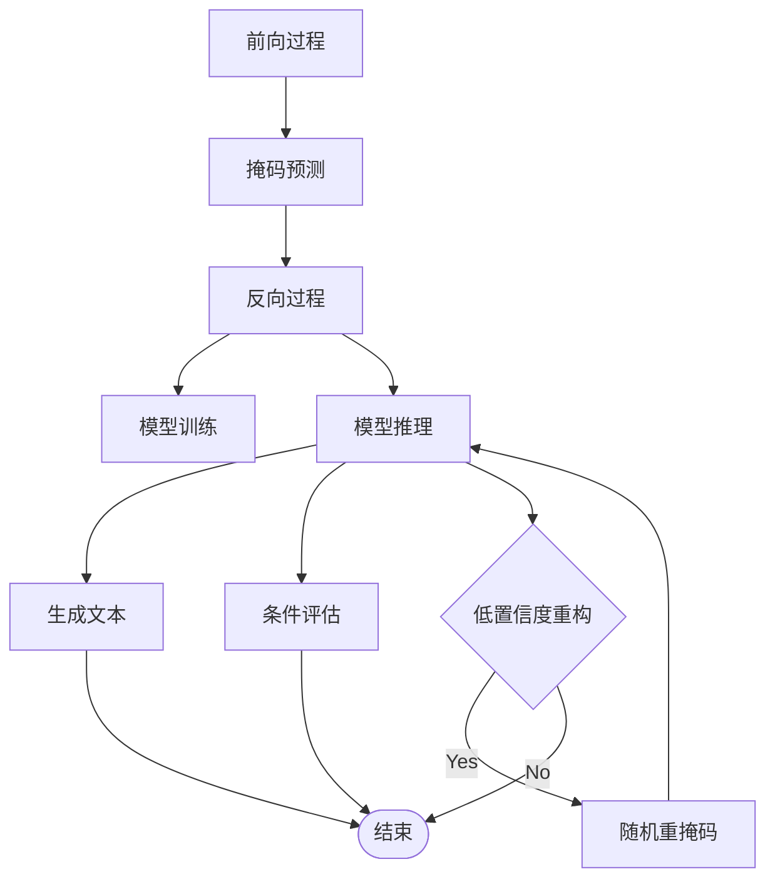

# arxiv:2502.09992

---

## 📑 文字综述

# LLaDA-V: Large Language Diffusion Models with Visual Instruction Tuning 论文精读报告

## 核心贡献

LLaDA-V 的核心贡献在于其开创性地将纯扩散模型架构应用于视觉指令调优任务，打破了当前多模态大语言模型（MLLM）领域普遍依赖自回归模型的范式。具体而言，其创新点体现在以下几个方面：

1.  **纯扩散模型架构的视觉指令调优**: LLaDA-V 首次提出并验证了使用纯扩散模型进行视觉指令调优的可行性。与主流的自回归模型不同，它利用扩散模型的强大生成能力和并行处理潜力，为多模态理解和生成任务提供了一种全新的、可能更具效率和鲁棒性的解决方案。
2.  **双向 Transformer 架构的优势**: 模型采用了双向 Transformer 架构，这使得它在处理序列信息时能够同时考虑上下文的左右两端，从而更全面地捕捉信息间的依赖关系。这种设计对于理解复杂的视觉指令和生成连贯的多模态响应至关重要。
3.  **提升多模态任务性能**: 通过在包含图像和指令的数据集上进行视觉指令调优，LLaDA-V 显著提升了模型理解和遵循视觉指令的能力。这使其在多模态推理、图像描述、视觉问答等任务上展现出与现有先进模型相媲美的甚至更优的性能。
4.  **挑战自回归模型的局限性**: LLaDA-V 的成功表明，强大的多模态能力并非自回归模型所独有。它为语言建模领域提供了一个新的范式，挑战了现有 LLM 的局限性，并为未来研究开辟了新的方向，尤其是在模型的可扩展性、上下文学习和指令遵循方面。

## 方法论详解

LLaDA-V 的方法论核心在于其**纯扩散模型架构**以及在此基础上的**视觉指令调优**。与传统的自回归模型（如 GPT 系列）逐个 token 生成文本不同，扩散模型通过一个逐步去噪的过程来生成数据。

**1. 基础扩散模型 LLaDA**:
LLaDA-V 的基础是 LLaDA 模型，它是一个大型语言扩散模型。LLaDA 的核心思想是通过一个**前向扩散过程**和一个**反向去噪过程**来学习数据分布 $p_\theta(x_0)$。

*   **前向过程**: 在前向过程中，原始输入序列 $x_0$（例如，文本 token 序列）会逐步被添加噪声，直到在时间步 $t=1$ 时，序列 $x_t$ 变成完全随机的噪声。对于任意时间步 $t \in (0, 1)$，序列 $x_t$ 是部分被噪声“掩码”的，其中每个 token 以概率 $t$ 被掩码（替换为特殊标记或噪声），以概率 $1-t$ 保持不变。
*   **反向过程**: 反向过程则旨在从噪声中恢复原始数据。它通过一个参数化的模型 $p_\theta(x_t | x_t)$ 来迭代地预测被掩码的 token，从 $t=1$ 逐步恢复到 $t=0$，最终生成清晰的序列 $x_0$。这个预测器通常是一个 Transformer 网络。
*   **训练目标**: LLaDA 的训练目标是最小化预测掩码 token 的损失，通常使用交叉熵损失，并且该损失**仅在被掩码的 token 上计算**。这使得模型能够专注于预测缺失的部分，而不是对整个序列进行建模。

**2. 视觉指令调优 (Visual Instruction Tuning)**:
LLaDA-V 在 LLaDA 的基础上，引入了视觉指令调优。这意味着模型需要学习理解和响应包含图像信息的指令。

*   **多模态输入**: 模型接收的输入不再仅仅是文本，而是文本和图像的组合。图像信息需要被编码成模型能够理解的表示，通常通过一个预训练的视觉编码器（如 CLIP 的视觉编码器）来实现。
*   **指令格式**: 训练数据被设计成指令-响应的格式，其中指令可能包含对图像的引用或要求。例如，“描述这张图片中的主要物体”或“根据图片内容回答这个问题”。
*   **调优过程**: 模型在包含大量图像-文本指令对的数据集上进行微调。通过这个过程，模型学会将视觉信息与语言指令关联起来，并生成符合指令要求的文本响应。扩散模型的反向生成过程被用于生成这些响应。

**3. 关键设计决策**:

*   **纯扩散模型**: 选择纯扩散模型而非自回归模型，是为了利用扩散模型在并行生成、潜在的更高生成质量以及处理长序列方面的优势。这是一种对现有 MLLM 范式的根本性挑战。
*   **双向 Transformer**: 采用双向 Transformer 作为核心的掩码预测器，能够更有效地捕捉序列中的长距离依赖关系和上下文信息，这对于理解复杂的视觉指令至关重要。
*   **掩码策略**: LLaDA 使用一种概率性的掩码策略，允许模型在训练过程中学习处理不同程度的噪声和缺失信息。
*   **低置信度重构 (Low-Confidence Reconstruction)**: 算法中提及的“低置信度重构策略”可能是一种在反向过程中，当模型对某个 token 的预测置信度较低时，采取的一种特殊处理方式，例如保留部分噪声或引入更多随机性，以增强生成的多样性或鲁棒性。
*   **条件似然评估 (Conditional Likelihood Evaluation)**: 为了评估模型在给定条件下的生成能力，引入了条件似然评估。这通常涉及蒙特卡洛采样来估计条件概率，并采用低方差的估计方法以提高评估的稳定性和准确性。

通过上述方法，LLaDA-V 能够有效地将扩散模型的强大生成能力与视觉指令调优相结合，从而在多模态任务上取得优异表现。

## 与现有方法对比

| 特征/维度         | LLaDA-V (纯扩散)                               | LLaVA (自回归)                                   | 其他自回归 MLLM (如 GPT-4V, Gemini) |
| :---------------- | :--------------------------------------------- | :----------------------------------------------- | :---------------------------------- |
| **模型架构**      | 纯扩散模型 (双向 Transformer 作为预测器)       | 视觉编码器 + LLM (通常是自回归 Transformer)      | 视觉编码器 + LLM (自回归 Transformer) |
| **生成机制**      | 逐步去噪生成 (并行性潜力)                      | 自回归生成 (逐 token 生成)                       | 自回归生成 (逐 token 生成)          |
| **训练范式**      | 掩码预测损失 (仅在掩码 token 上计算)           | 标准语言模型损失 (交叉熵，在所有 token 上计算)   | 标准语言模型损失                    |
| **多模态融合**    | 通过视觉编码器将图像特征注入扩散模型           | 通过投影层将视觉特征与 LLM 交互                  | 类似 LLaVA 的融合方式               |
| **优势**          | 潜在的并行生成效率，对长序列处理可能更鲁棒     | 成熟的生态系统，广泛的应用和研究基础             | 强大的通用能力，广泛的知识覆盖      |
| **挑战**          | 扩散模型训练成本较高，推理速度可能受限 (但有并行性) | 潜在的自回归生成瓶颈，长序列推理慢               | 训练成本高昂，模型规模巨大          |
| **核心创新点**    | 纯扩散模型用于视觉指令调优                     | 视觉指令调优的开创性工作，连接视觉与语言模型     | 规模化和通用性                      |

**分析**:

LLaDA-V 的核心优势在于其**纯扩散模型架构**。与 LLaVA 和其他主流自回归 MLLM 不同，LLaDA-V 不依赖于预训练的 LLM，而是从头开始构建一个扩散模型来处理多模态任务。这意味着它在理论上可以更好地控制整个生成过程，并且扩散模型的并行生成特性（尽管在实际推理中仍需迭代）可能带来比自回归模型更高的效率潜力，尤其是在处理长序列或需要高度并行化的场景下。其双向 Transformer 架构也为更深层次的上下文理解提供了基础。

然而，扩散模型的训练通常比自回归模型需要更多的计算资源和时间。虽然 LLaDA-V 在性能上展现出竞争力，但其**推理速度**和**训练成本**是需要仔细权衡的因素。LLaVA 作为视觉指令调优的先驱，已经建立了一个成熟的研究和应用生态，其方法相对更容易实现和扩展。GPT-4V 和 Gemini 等模型则代表了当前最先进的自回归 MLLM，它们通过巨大的模型规模和海量数据实现了强大的通用能力，但 LLaDA-V 的出现表明，即使不依赖于这些巨型自回归模型，也能在特定任务上达到甚至超越它们的性能水平，为多模态模型的研究提供了新的技术路径。

## 实现要点

在实现 LLaDA-V 时，需要关注以下几个关键要点：

1.  **多模态数据处理与融合**: 需要设计高效的图像编码器（如 CLIP ViT）来提取图像特征，并将其与文本 token 序列进行有效融合。这可能涉及将图像特征投影到与文本 token 相同的嵌入空间，或者在 Transformer 的注意力机制中引入图像信息。
2.  **扩散模型的实现细节**: 准确实现前向加噪过程和反向去噪过程至关重要。这包括定义噪声调度器（如线性、余弦调度）、实现噪声添加函数以及构建能够预测噪声或原始数据（取决于具体实现）的 Transformer 模型。
3.  **掩码策略与损失计算**: LLaDA 的核心在于仅在掩码 token 上计算损失。实现时需要精确地生成掩码 token（例如，使用 `MASK_TOKEN_ID`），并确保损失函数（如交叉熵）只应用于这些被掩码的位置，以指导模型学习预测缺失信息。
4.  **视觉指令调优的数据集构建**: 需要收集或构建高质量的视觉指令数据集，确保指令的多样性、清晰度以及与图像内容的强关联性。数据预处理流程需要将图像和文本指令统一格式化，以便模型输入。
5.  **推理与采样策略**: 实现灵活的采样策略，包括支持自回归采样（如果需要）和扩散采样。对于扩散采样，需要实现反向过程的迭代生成，并可能需要集成如低置信度重构等优化策略来提升生成质量或多样性。

## 局限性与未来方向

**局限性**:

1.  **计算成本与推理速度**: 扩散模型的训练通常比自回归模型更耗时且计算量更大。尽管扩散模型具有并行生成潜力，但实际的迭代去噪过程可能导致推理速度不如高度优化的自回归模型，尤其是在需要低延迟的应用场景下。
2.  **通用性与知识覆盖**: LLaDA-V 的核心是视觉指令调优，其在特定多模态任务上的性能可能优异，但其通用知识覆盖和推理能力可能不如经过海量文本预训练的超大规模自回归模型（如 GPT-4）。模型在纯文本理解和生成方面的能力可能需要进一步加强。
3.  **对噪声和掩码的敏感性**: 扩散模型对噪声的敏感性是其核心，但这也可能意味着模型在处理高度模糊或信息不完整的图像时，其性能会受到较大影响。同时，掩码策略的设计对训练效果至关重要，不当的掩码可能导致模型学习效率低下。

**未来方向**:

1.  **加速推理**: 研究更高效的扩散模型采样算法，例如 DDIM、ODE 求解器等，或者探索模型蒸馏、量化等技术，以显著提升 LLaDA-V 的推理速度，使其更具实用性。
2.  **增强通用能力**: 将 LLaDA-V 的扩散模型架构与更广泛的文本预训练相结合，或者探索在扩散模型中直接融入更丰富的世界知识，以提升其在纯文本任务和更广泛领域的通用性。
3.  **更精细的多模态交互**: 探索更先进的多模态融合机制，例如更深层次的跨模态注意力，或者将视觉信息更精细地融入扩散模型的每一步去噪过程，以实现更精细的视觉理解和生成控制。
4.  **多模态指令的复杂性**: 扩展 LLaDA-V 处理更复杂、更抽象的多模态指令的能力，例如涉及逻辑推理、因果分析或创造性生成等任务，进一步挖掘纯扩散模型在复杂指令遵循方面的潜力。

## 延伸阅读

1.  **LLaDA 论文**: "LLaDA: Large Language Diffusion Models" (如果 LLaDA-V 是基于 LLaDA，阅读 LLaDA 的原始论文是理解其基础架构的关键)。
2.  **LLaVA 论文**: "Visual Instruction Tuning" (作为视觉指令调优领域的代表性工作，理解 LLaVA 的方法和局限性有助于对比 LLaDA-V 的创新点)。
3.  **Diffusion Models for Text Generation**: "Diffusion-LM: Encoding-Decoding Models for Text Generation" 或 "Generative Pretraining with Diffusion Models" (了解扩散模型在文本生成领域的最新进展和挑战)。
4.  **Transformer Architecture**: "Attention Is All You Need" (理解 Transformer 作为核心架构的重要性，以及其在序列建模中的作用)。
5.  **Masked Language Models**: "BERT: Pre-training of Deep Bidirectional Transformers for Language Understanding" (理解掩码机制在预训练模型中的作用，以及双向 Transformer 的优势)。

---

## 📊 算法流程图

