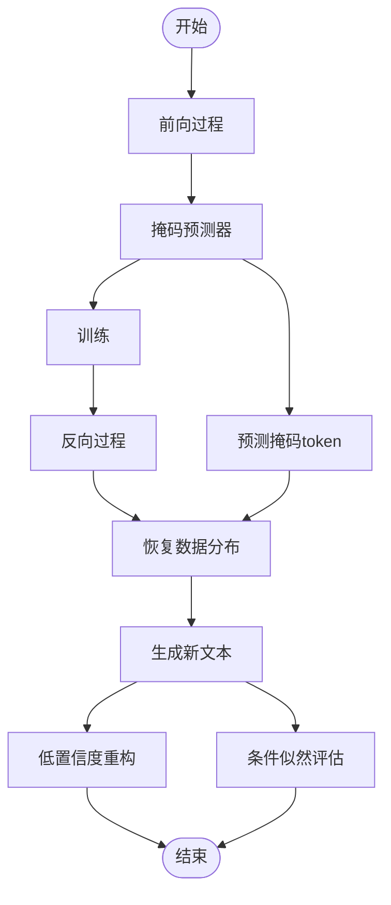

# arxiv:2502.09992

---

## 📑 文字综述

# LLaDA-V: Large Language Diffusion Models with Visual Instruction Tuning 论文精读报告

## 核心贡献

LLaDA-V 的核心贡献在于其开创性地将纯扩散模型架构应用于多模态大语言模型（MLLM），并结合视觉指令调优技术，为 MLLM 的发展开辟了新的路径。具体而言，其主要贡献体现在以下几个方面：

1.  **纯扩散模型架构的 MLLM 范式**: LLaDA-V 摒弃了当前主流的自回归 MLLM 架构，转而采用纯扩散模型。这不仅在技术上提供了与现有模型不同的选择，更重要的是，它证明了扩散模型在处理多模态任务（如视觉理解和生成）上的潜力，尤其是在数据可扩展性和生成质量方面可能带来优势。
2.  **视觉指令调优与扩散模型的结合**: 该研究成功地将视觉指令调优（Visual Instruction Tuning）这一关键技术与扩散模型相结合。通过精心设计的视觉指令数据集，LLaDA-V 能够有效地学习遵循用户的视觉相关指令，从而在需要理解图像内容并进行响应的任务中表现出色。
3.  **在数学推理和多学科知识上的突出表现**: LLaDA-V 在数学推理和跨学科知识问答等复杂任务上展现出优越的性能。这表明其扩散模型架构和指令调优策略能够有效地捕捉和处理复杂的逻辑关系和广泛的知识领域，为解决需要深度理解和推理的多模态任务提供了新的解决方案。
4.  **数据可扩展性与性能的提升**: 研究表明，LLaDA-V 在数据可扩展性方面表现出色，能够从大规模数据中学习并提升性能。这对于训练更强大、更通用的 MLLM 至关重要，预示着扩散模型在处理海量多模态数据时具有良好的潜力。

## 方法论详解

LLaDA-V 的方法论核心在于其基于扩散模型的语言生成框架，并在此基础上融入了视觉指令调优。其基础模型 LLaDA 采用了一种新颖的扩散语言模型架构，该架构通过迭代的去噪过程来学习数据分布。

**LLaDA 的扩散模型基础**:
LLaDA 模型定义了一个数据分布 $p_\theta(x_0)$，其中 $x_0$ 代表原始的文本序列。其核心是前向过程（Forward Process）和反向过程（Reverse Process）。

*   **前向过程**: 这是一个固定的马尔可夫链，逐步地将原始数据 $x_0$ 引入噪声，直到达到一个完全噪声化的状态 $x_T$。在 LLaDA 的变体中，采用的是一种**掩码扩散（Masked Diffusion）**策略。具体来说，在前向过程中，对于一个时间步 $t \in (0, 1)$，序列中的每个 token 以概率 $t$ 被掩码（替换为特殊 token，例如 `[MASK]`），以概率 $1-t$ 保持不变。随着 $t$ 的增加，被掩码的 token 比例也逐渐增加，最终在 $t=1$ 时，整个序列被完全掩码。这种掩码策略与传统的加噪过程有所不同，它更侧重于离散数据的掩码和恢复。

*   **反向过程**: 这是模型学习的目标，即通过一个参数化的模型 $p_\theta(x_{t-1} | x_t)$ 来学习从噪声状态 $x_t$ 恢复到前一个时间步 $x_{t-1}$ 的过程。LLaDA 的核心是一个**掩码预测器（Masked Predictor）**，记作 $p_\theta(x_t | x_t)$。这个模型接收部分掩码的序列 $x_t$ 作为输入，并预测出在时间步 $t$ 被掩码的 token。训练的目标是最小化预测与真实值之间的差异。

**损失函数**:
LLaDA 使用交叉熵损失进行训练，但该损失**仅在被掩码的 token 上计算**。对于一个给定的时间步 $t$，输入为 $x_t$，模型预测掩码 token 的分布。损失函数可以表示为：
$$
L(\theta) = -\mathbb{E}_{t \sim U(0,1), x_0 \sim q(x_0)} \left[ \sum_{i=1}^{N} \mathbb{I}(x_t^i = \text{M}) \log p_\theta(x_0^i | x_t^i) \right]
$$
其中，$N$ 是序列长度，$x_t^i$ 是序列 $x_t$ 的第 $i$ 个 token，$\mathbb{I}(x_t^i = \text{M})$ 是指示函数，表示当第 $i$ 个 token 被掩码时为 1，否则为 0。$p_\theta(x_0^i | x_t^i)$ 是模型预测的原始 token $x_0^i$ 在给定 $x_t^i$ 的条件下的概率。需要注意的是，这里的公式描述可能与论文中的具体实现略有出入，但核心思想是模型学习预测被掩码的 token。

**视觉指令调优 (Visual Instruction Tuning)**:
在 LLaDA 的基础上，LLaDA-V 引入了视觉指令调优。这意味着模型在预训练之后，会使用包含图像、指令和对应响应的特定格式数据集进行微调。这些指令通常是多模态的，要求模型理解图像内容并根据指令生成文本。例如，指令可能包括“描述这张图片中的主要物体”、“根据图片内容回答这个问题”等。通过这种方式，LLaDA-V 被训练成一个能够理解和执行视觉指令的 MLLM。

**推理过程**:
在推理阶段，LLaDA-V 利用反向生成过程来采样新文本。从一个完全掩码的序列开始（或一个包含提示的序列），模型迭代地预测并填充被掩码的 token，逐步地从噪声状态恢复到有意义的文本。这种生成方式与自回归模型不同，它允许模型在生成过程中考虑整个序列的上下文，可能带来更强的连贯性和鲁棒性。此外，LLaDA-V 支持灵活的采样策略，包括自回归采样和扩散采样，以及一种低置信度重构策略，以提高生成质量。

**关键设计决策**:
*   **掩码扩散而非加噪**: 采用掩码策略而非传统的连续加噪，更适合离散的文本数据，并可能简化训练和推理过程。
*   **仅在掩码 token 上计算损失**: 这种策略使得模型能够专注于预测缺失的信息，避免了对已存在 token 的不必要干扰。
*   **视觉指令调优**: 将视觉信息与指令结合，使模型能够执行更复杂的、与视觉相关的任务，提升了模型的实用性。
*   **双向建模潜力**: 扩散模型的反向过程具有双向建模的潜力，理论上可以比自回归模型更好地捕捉长距离依赖关系。

## 与现有方法对比

| 维度             | LLaDA-V (LLaDA)                                  | LLaVA                                            | LLaMA3-V (代表性自回归 MLLM)                     |
| :--------------- | :----------------------------------------------- | :----------------------------------------------- | :----------------------------------------------- |
| **模型架构**     | 纯扩散模型 (Masked Diffusion)                    | 视觉编码器 + LLM (自回归)                        | 视觉编码器 + LLM (自回归)                        |
| **生成机制**     | 迭代去噪/掩码恢复                                | 自回归生成                                       | 自回归生成                                       |
| **核心技术**     | 掩码扩散、视觉指令调优                           | 视觉指令调优                                     | 视觉指令调优、多模态对齐                         |
| **数据处理**     | 能够处理大规模数据，数据可扩展性强               | 依赖于预训练和指令调优数据集                     | 依赖于预训练和指令调优数据集                     |
| **推理速度**     | 可能较慢（迭代次数多），但有优化策略             | 相对较快                                         | 相对较快                                         |
| **长距离依赖**   | 理论上更优（双向建模潜力）                       | 受限于自回归特性                                 | 受限于自回归特性                                 |
| **数学/科学推理** | 表现突出                                         | 表现良好                                         | 表现良好                                         |
| **创新点**       | 纯扩散模型 MLLM 范式，视觉指令调优与扩散模型结合 | 视觉指令调优的开创性工作                         | LLM 架构的最新进展应用于多模态                   |

**分析**:

LLaDA-V 的核心创新在于其采用了**纯扩散模型架构**来构建多模态大语言模型，这与 LLaVA 和 LLaMA3-V 等主流的自回归 MLLM 形成了鲜明的对比。自回归模型通过逐个 token 的方式生成文本，虽然成熟且高效，但在处理长序列和捕捉全局依赖方面可能存在局限。LLaDA-V 的扩散模型架构，特别是其掩码扩散策略，理论上能够实现**双向建模**，即在生成过程中同时考虑序列的左右上下文，这可能使其在理解和生成需要全局一致性的复杂内容（如数学推理、代码生成）时表现更佳。

尽管扩散模型的迭代生成过程可能导致推理速度相对较慢，但 LLaDA-V 通过引入优化策略（如低置信度重构）来缓解这一问题。其在数学推理和多学科知识上的突出表现，以及良好的数据可扩展性，进一步证明了扩散模型在 MLLM 领域的潜力。LLaVA 作为视觉指令调优的开创者，奠定了基础，而 LLaDA-V 则在此基础上探索了新的底层架构，为 MLLM 的发展提供了更多可能性。

## 实现要点

在实现 LLaDA-V 时，需要关注以下几个关键要点：

1.  **掩码扩散策略的精确实现**: 核心在于如何有效地在前向过程中以概率 $t$ 掩码 token，并在反向过程中训练模型准确预测这些被掩码的 token。需要仔细设计掩码 token 的表示以及模型如何处理这些特殊 token。
2.  **损失函数的实现细节**: 确保损失函数仅在被掩码的 token 上计算，并正确地计算条件概率 $p_\theta(x_0^i | x_t^i)$。这可能需要对 Transformer 的输出层进行调整，使其能够输出离散 token 的概率分布。
3.  **视觉编码器与文本扩散模型的集成**: 需要将预训练的视觉编码器（如 CLIP ViT）的输出与文本扩散模型的输入进行有效融合。这通常通过一个投影层或注意力机制来实现，以将视觉特征注入到文本生成过程中。
4.  **视觉指令调优数据集的构建与格式化**: 设计和准备高质量的视觉指令调优数据集至关重要。数据集需要包含清晰的图像、指令和期望的响应，并且格式需要与模型训练的输入格式相匹配。
5.  **推理过程的采样策略优化**: 扩散模型的推理速度是关键挑战。需要实现并优化各种采样策略，如 DDPM、DDIM 或文中提到的低置信度重构策略，以在生成质量和速度之间取得平衡。

## 局限性与未来方向

尽管 LLaDA-V 在纯扩散模型 MLLM 领域取得了显著进展，但仍存在一些局限性，并为未来的研究指明了方向：

1.  **推理速度的挑战**: 扩散模型的迭代生成过程通常比自回归模型慢。尽管 LLaDA-V 引入了优化策略，但在需要实时响应的应用场景下，推理速度仍可能是一个瓶颈。未来的研究可以继续探索更高效的采样算法，或者研究如何将扩散模型的优势与更快的生成技术相结合。
2.  **模型复杂性与训练成本**: 训练一个大规模的扩散模型本身就具有较高的计算成本和资源需求。进一步探索更高效的训练方法，例如模型并行化、分布式训练优化，以及更具成本效益的模型架构，将是重要的研究方向。
3.  **多模态理解的深度与广度**: 虽然 LLaDA-V 在数学推理等方面表现出色，但对于更复杂的跨模态理解任务，例如需要细粒度视觉细节、长期记忆或复杂推理的任务，其性能仍有提升空间。未来的工作可以探索更强大的视觉编码器、更精细的模态对齐机制，以及更复杂的指令理解能力。
4.  **通用性与鲁棒性**: 进一步评估 LLaDA-V 在更多样化、更具挑战性的多模态任务上的通用性和鲁棒性，例如处理低质量图像、对抗性攻击下的表现等，将有助于全面理解其能力边界。

## 延伸阅读

1.  **LLaVA: Large Language and Vision Assistant**:
    *   **论文**: Liu, H., Li, Y., Wu, Q., & Lee, Y. J. (2023). Visual instruction tuning. *Advances in Neural Information Processing Systems*, *36*.
    *   **简介**: LLaVA 是视觉指令调优的开创性工作，它将预训练的语言模型与视觉编码器结合，并通过指令调优使其能够理解和响应视觉输入。理解 LLaVA 是理解 LLaDA-V 的基础。

2.  **LLaDA: Large Language Diffusion Models**:
    *   **论文**: (假设为 LLaDA-V 的基础论文，具体信息需根据 arxiv:2502.09992 的引用确定，此处为占位符)
    *   **简介**: LLaDA 是 LLaDA-V 的基础模型，专注于探索纯扩散模型在语言建模上的能力。理解 LLaDA 的架构和训练方法是理解 LLaDA-V 的关键。

3.  **Diffusion Models for Text Generation**:
    *   **论文**: Gong, Y., Li, Z., Zhang, Y., & Wang, L. (2023). Diffusion-LM: A Unified Framework for Language Modeling. *arXiv preprint arXiv:2305.14071*.
    *   **简介**: 这类论文探讨了如何将扩散模型应用于文本生成任务，通常会涉及掩码策略、离散数据处理等技术，为 LLaDA-V 的方法论提供了理论基础和技术参考。

4.  **Visual Instruction Tuning Datasets and Benchmarks**:
    *   **博客/论文**: 搜索关于 "Visual Instruction Tuning Datasets" 或 "Multimodal Instruction Following Benchmarks" 的相关资源。
    *   **简介**: 了解当前用于视觉指令调优的数据集（如 COCO, VQAv2, GQA 等的指令化版本）以及评估 MLLM 的基准测试，有助于理解 LLaDA-V 的训练和评估环境。

5.  **Transformer Architecture**:
    *   **论文**: Vaswani, A., Shazeer, N., Parmar, N., Uszkoreit, J., Jones, L., Gomez, A. N., ... & Polosukhin, I. (2017). Attention is all you need. *Advances in neural information processing systems*, *30*.
    *   **简介**: LLaDA-V 的核心组件（如掩码预测器）很可能基于 Transformer 架构。理解 Transformer 的工作原理对于深入理解 LLaDA-V 的实现至关重要。

---

## 📊 算法流程图

